<!-- ========================================================= -->

<!--                       QUHU README                        -->

<!-- ========================================================= -->

Quhu

Văn Quốc Hùng · Frontend Developer

  I build warm, playful interfaces where thoughtful engineering meets
   
  character, motion and a little bit of unexpected joy.

 

  

 

<table width="100%">
  <tr>
    <td align="center">

“I turn ideas into digital spaces

that feel clear, responsive and

genuinely fun to explore.”

</td>

  </tr>
</table>

 

<table width="100%">
  <tr>
    <td width="50%" valign="top">

🌿 About Me

Mình là Quốc Hùng, một Frontend Developer yêu thích việc biến ý tưởng thành những giao diện rõ ràng, thân thiện và có cá tính.

Mình quan tâm đến code sạch, khả năng bảo trì, responsive design và những chuyển động nhỏ giúp trải nghiệm tự nhiên hơn.

Khi không code, mình thường khám phá UI animation, thiết kế cozy và các cách mới để làm giao diện trở nên sống động.

   </td>
    <td width="50%" valign="top">

🧰 Skills & Tools

  
  
  

  
  
  

  
  
  
  

   </td>
  </tr>
</table>

 

🌼 Quick Facts

<table width="100%">
  <tr>
    <td width="25%" align="center">
      <strong>📍 Based in</strong> 
      Ho Chi Minh City
    </td>
    <td width="25%" align="center">
      <strong>💻 Role</strong> 
      Frontend Developer
    </td>
    <td width="25%" align="center">
      <strong>🎬 Loves</strong> 
      UI Motion
    </td>
    <td width="25%" align="center">
      <strong>☕ Powered by</strong> 
      Coffee
    </td>
  </tr>
</table>

 

🌱 What I Care About

<table width="100%">
  <tr>
    <td width="33%" valign="top">

🎯 Thoughtful UI

Giao diện rõ ràng, có chủ đích và không có chi tiết thừa.

   </td>
    <td width="33%" valign="top">

📱 Responsive Design

Hoạt động tốt trên desktop, tablet và thiết bị di động.

   </td>
    <td width="33%" valign="top">

♿ Accessibility

Trải nghiệm dễ đọc, dễ thao tác và dễ tiếp cận.

   </td>
  </tr>
  <tr>
    <td width="33%" valign="top">

✨ Playful Motion

Animation vừa đủ, tự nhiên và hỗ trợ trải nghiệm.

   </td>
    <td width="33%" valign="top">

🧩 Clean Architecture

Code dễ đọc, dễ bảo trì và thuận tiện để mở rộng.

   </td>
    <td width="33%" valign="top">

⚡ Performance

Website tải nhanh và hạn chế tài nguyên không cần thiết.

   </td>
  </tr>
</table>

 

⭐ Featured Projects

<table width="100%">
  <tr>
    <td width="50%" valign="top">

Wander UI

A cozy travel landing page with smooth scrolling, playful interactions and responsive visuals.

React Sass GSAP

   </td>
    <td width="50%" valign="top">

Dashboard Kit

A responsive dashboard template with modern components, charts and accessible interactions.

React JavaScript CSS

   </td>
  </tr>
</table>

 

✨ GitHub Activity

<table width="100%">
  <tr>
    <td width="33%" align="center">
      <strong>📁 Repositories</strong>  
      <a href="https://github.com/hungvq98?tab=repositories">View projects</a>
    </td>
    <td width="33%" align="center">
      <strong>🐙 GitHub Profile</strong>  
      <a href="https://github.com/hungvq98">@hungvq98</a>
    </td>
    <td width="33%" align="center">
      <strong>🎯 Current Focus</strong>  
      React · UI Motion · Creative Frontend
    </td>
  </tr>
</table>

 

💌 Let’s Connect

<table width="100%">
  <tr>
    <td width="33%" align="center">
      
    </td>
    <td width="33%" align="center">
      
    </td>
    <td width="33%" align="center">
      
    </td>
  </tr>
</table>

 

Thanks for stopping by! Have a great day 🌼

Designed and built with ☕ by Quốc Hùng

